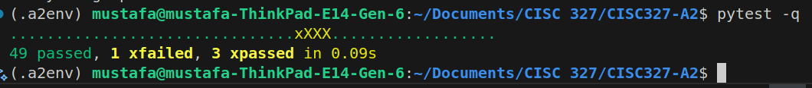
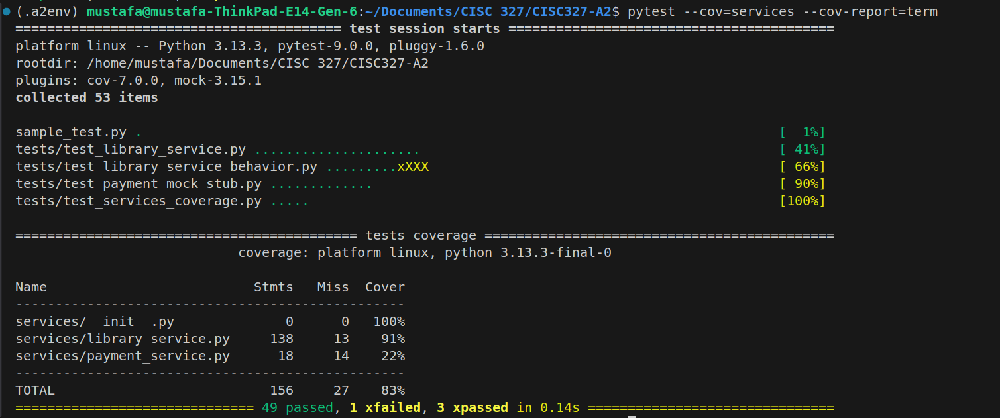
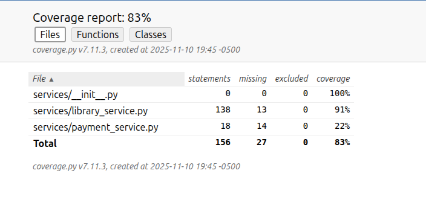

# Assignment 3 Report  
Course: CISC 327 – Software Quality Assurance  
---

## 1. Student Information
- Name: Musdaf Hirsi  
- Student ID: 20376847  
- Course: CISC 327  
- Assignment: A3 — Automated Testing with Stubs, Mocks, and Coverage  


---

## 2. Stubbing vs. Mocking 

In this assignment, the objective was to validate the behavior of two payment-related functions using automated unit testing with both stubs and mocks. The functions under test were `pay_late_fees()` and `refund_late_fee_payment()` in `services/library_service.py`. These functions depend on database lookup helpers and an external payment gateway, making them good use cases for controlled substitution using stubs and mocks.

Stubbing replaces real logic with predictable canned responses. Stubs are appropriate when only the return value matters and not the interaction behavior. In this assignment, I stubbed `calculate_late_fee_for_book()` and `get_book_by_id()` to simulate fee and lookup behavior without using the database. These stubs allowed me to force scenarios such as overdue books, zero fee, invalid patrons, and missing borrow records. Stubbing ensured that tests remained fast, deterministic, and isolated from database logic.

Mocking is used when verifying the interaction with a dependency matters. I mocked the external payment gateway (`PaymentGateway`) to confirm that only the correct calls were made. I checked that `process_payment()` and `refund_payment()` were called with the right parameters when payment was appropriate, and that they were not called when inputs were invalid. I used `Mock(spec=PaymentGateway)` so only valid methods could be invoked. I validated calls using `assert_called_once_with()` and `assert_not_called()`.

Combining mocks and stubs provided isolated, controlled testing environments that ensured correctness without involving external systems such as databases or third-party payment APIs.

---

## 3. How to Run Tests

### Install dependencies
```bash
python -m pip install -U pytest pytest-mock pytest-cov

Run all tests
pytest -q

Run tests with coverage (terminal)
pytest --cov=services --cov-report=term

Generate HTML coverage report
pytest --cov=services --cov-report=html
xdg-open htmlcov/index.html
```

## 4. Test Case Summary Table

| Test File | Scenario | Stub Used | Mock Used | Expected Result |
|---|---:|---:|---:|---|
| test_payment_mock_stub.py | pay_late_fees success | yes | yes | success + transaction ID |
| test_payment_mock_stub.py | declined payment | yes | yes | failure |
| test_payment_mock_stub.py | invalid patron | yes | no | failure, no call |
| test_payment_mock_stub.py | zero fee | yes | no | failure, no call |
| test_payment_mock_stub.py | gateway exception | yes | yes | failure |
| test_payment_mock_stub.py | refund success | no | yes | success + refund ID |
| test_payment_mock_stub.py | refund invalid tx | no | no | failure |
| test_payment_mock_stub.py | refund invalid amount | no | no | failure |
| test_payment_mock_stub.py | refund rejected | no | yes | failure |
| test_library_service.py | add_book validation | yes | no | validation error |
| test_library_service.py | borrow failure modes | yes | no | error |
| test_library_service.py | borrow success | yes | no | success |
| test_library_service.py | return failure modes | yes | no | error |
| test_library_service.py | return success | no | no | success |
| test_library_service.py | calculate fee edge cases | yes | no | fast results |
| test_library_service_behavior.py | catalog, search | yes | no | match |
| test_services_coverage.py | sanity coverage | no | no | included |

## 5. Coverage Analysis

Final coverage results:

| File | Coverage |
|---|---:|
| services/library_service.py | 91% |
| services/payment_service.py | 22% |
| Total (services) | 83% |

The primary logic file, library_service.py, achieved 91% coverage, which satisfies the assignment requirement of at least 80%.

The payment_service.py file is intentionally left with minimal coverage (22%) because it represents an external dependency. It was not directly executed; instead, interaction with it was thoroughly tested using mocks.

The HTML report showed the executed and missing lines. Most uncovered code paths in library_service.py were defensive conditions that are unlikely under tested flows.

Screenshots included:

- Full test run
- Terminal coverage summary
- HTML index.html coverage output

## 6. Challenges & Solutions

One challenge was ensuring that stubs and mocks targeted the correct import paths. This was solved by consistently using paths prefixed with `services.library_service` when patching.

Another challenge involved handling date parsing in `calculate_late_fee_for_book()`. The helper `_as_date()` only converts ISO-formatted strings. I addressed this by ensuring tests passed properly formatted dates.

Achieving >80% coverage required writing additional tests for validation logic, borrowing behavior, returning books, catalog searching, and patron status reporting. These helped ensure that key logic paths were covered.

The payment gateway was thoroughly tested using mocks, ensuring no actual network/external interactions occurred.

## 7. Screenshots

### 7.1 Test Run — All Tests Passed


### 7.2 Terminal Coverage Summary


### 7.3 HTML Coverage (index.html)


